# Cuarta sesión: Servicios de Azure Compute

En esta sesion aprendimos sobre los diversos servicios de computo que Azure ofrece, de los cuales destacaron _Azure Virtual Machines_ y _Azure App Services_, siendo estos de los cuales se trataron las practicas de hoy.

### Practica 1

En esta practica exploramos el servicio _Azure Virtual Machines_, el cual es un IaaS que ofrece el control total del sistema operativo que se va a trabajar. En pocas palabras, es un servicio que **virtualiza una computadora** y la pone a nuestra total disposición.

Para la practica, tuvimos que conectar a nuestro dispositivo una maquina virtual, y dentro de esa esta conectar otra.

Para iniciar, primero debemos de ir al apartado de _Virtual Machines_ dentro del portal de Azure, y crear el recurso.

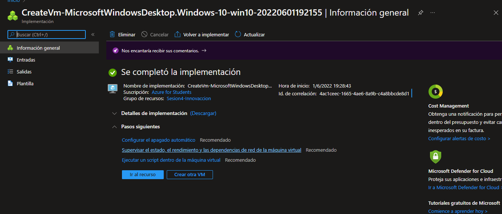

Luego creamos la segunda maquina virtual, pero esta vez hay que asegurarnos que ésta se encuentre dentro de la misma red virtual que la anterior, para que puedan conectarse entre sí

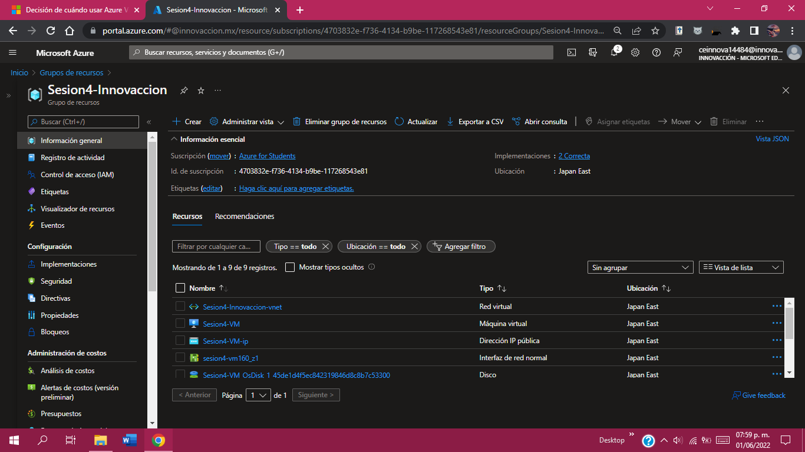

Una vez hecho esto, debemos ir al grupo donde se alojan nuestros recursos y entrar en la primera VM, y descargar su respectivo archivo RDP

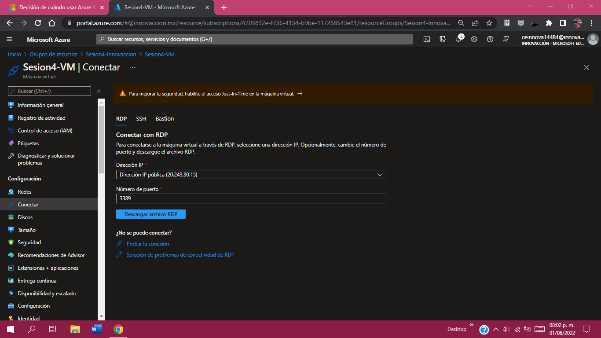

Ejecutamos el archivo descargado para iniciar la conexión con la Maquina virtual. Nos pedirá los datos de usuario y contraseña de estas, siendo estos los mismos que determinamos durante la creacion de los recursos.
Una vez hecho el proceso, podemos acceder a la maquina virtual desde nuestro dispositivo.

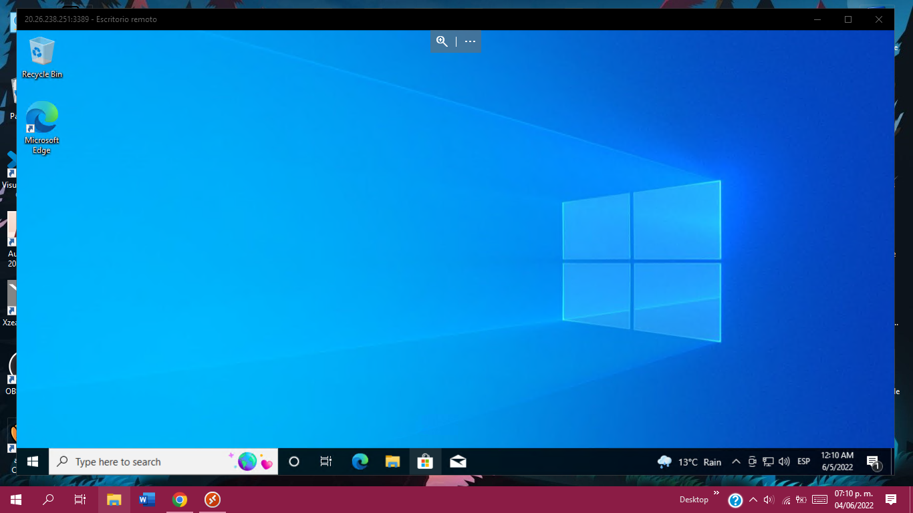

Una vez dentro, esperamos que se inicie correctamente para abrir el CMD y enviar un ping a la IP de la segunda VM, usando el comando
> ping (IP privada de la 2da VM)

Esto es con el fin de verificar que haya una conexion directa o no.

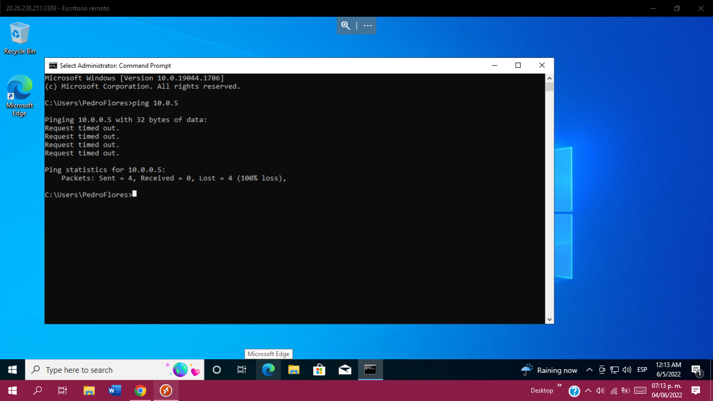

Con esto hecho, ahora procederemos a ejecutar la aplicación _Windows PowerShell_ como administrador, e insertamos lo siguiente
> New-NetFirewallRule -DisplayName "Allow ICMPv4-In" -Protocol ICMPv4

> mstsc /v:(IP privada de la 2da VM)

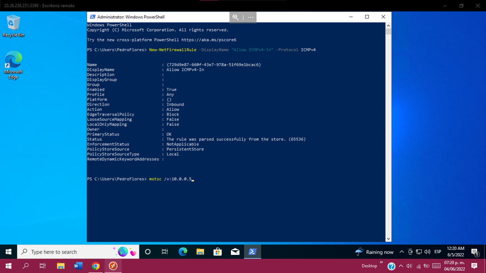

Con esto, se hará una conexión directa con la segunda maquina virtual, y se tendrá lista la practica.

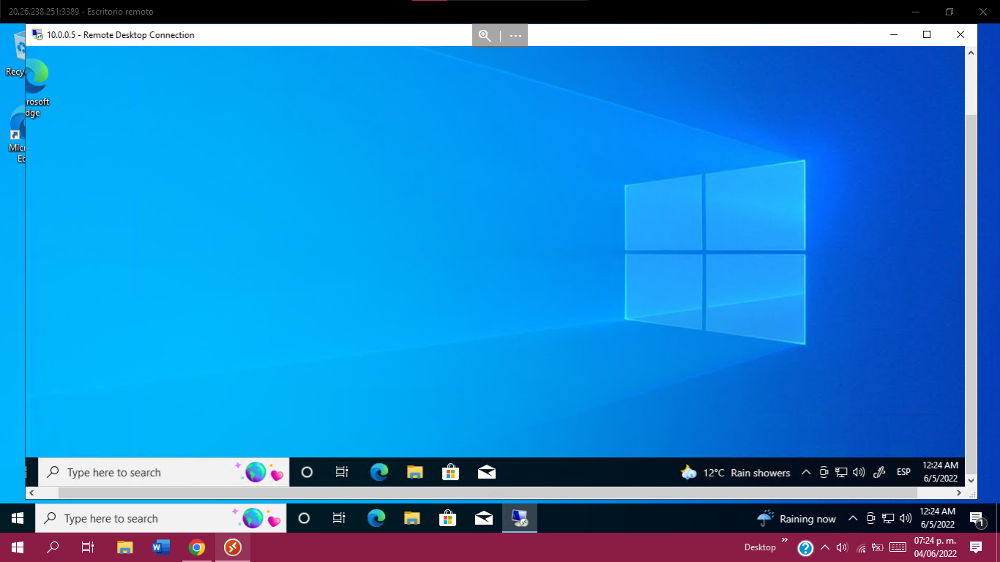

A este punto, se logró tener una VM dentro otra VM.

### Practica 2

En esta practica se usara un _App Service_, el cual habilita servicios web de Azure. En pocas palabras, es un servicio de hosting para paginas web, por lo que podria ser considerado como una IaaS.

Para realizar la practica, primero tuvimos que crear el recurso _App Service_, cuidando que la pila de entorno sea PHP 8.0 y cambiando su tamaño para que sea gratis.

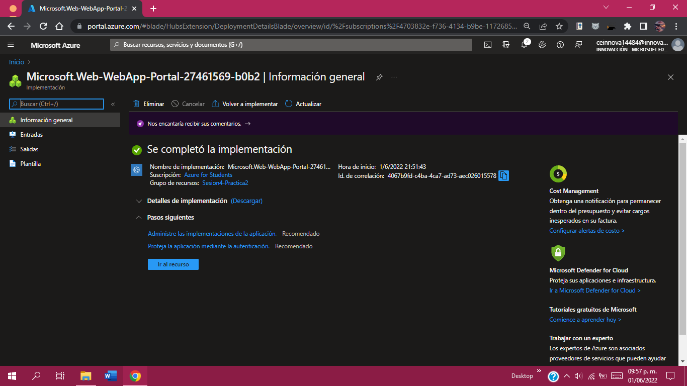

A continuacion, lo comun seria crear el codigo de la pagina en .html, sin embargo por motivos de tiempo nosotros usamos un repositorio web de GitHub.

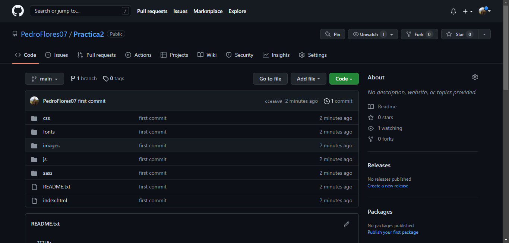

Luego, fue necesario implementar en nuestro recurso de Azure una opcion para que tome los archivos del repositorio remoto y los use para la pagina Web.

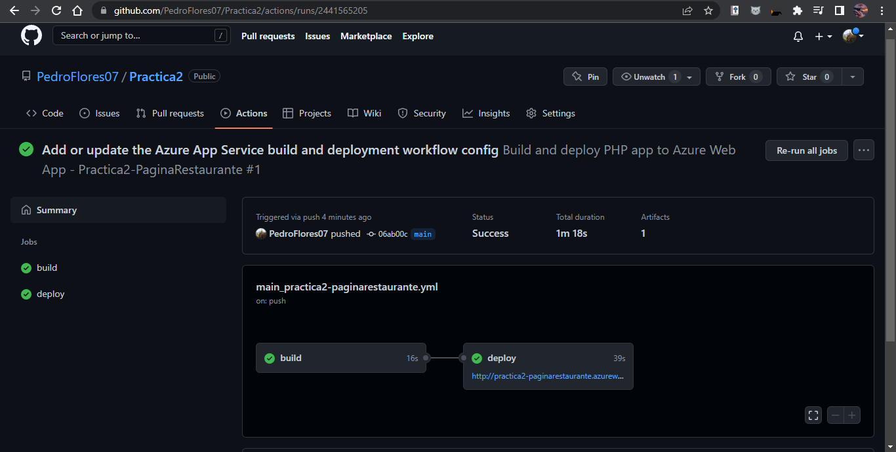

Una vez hecho esto, se puede observar en la pagina del repositorio, en la pestaña "Activos" como se implementa nuestra pagina web.

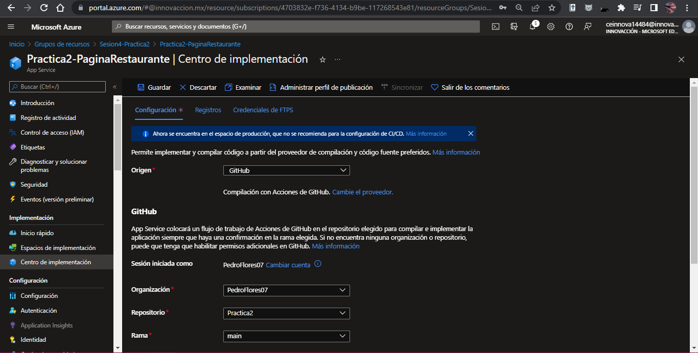

Finalmente, solo accedemos a nuestra pagina web creada y podremos observar el resultado final

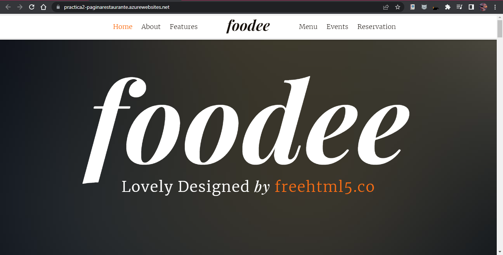

Con esto finalizan las dos practicas correspondientes a esta sesión.